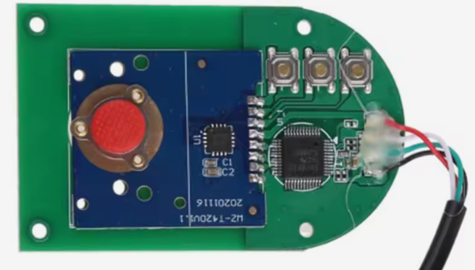
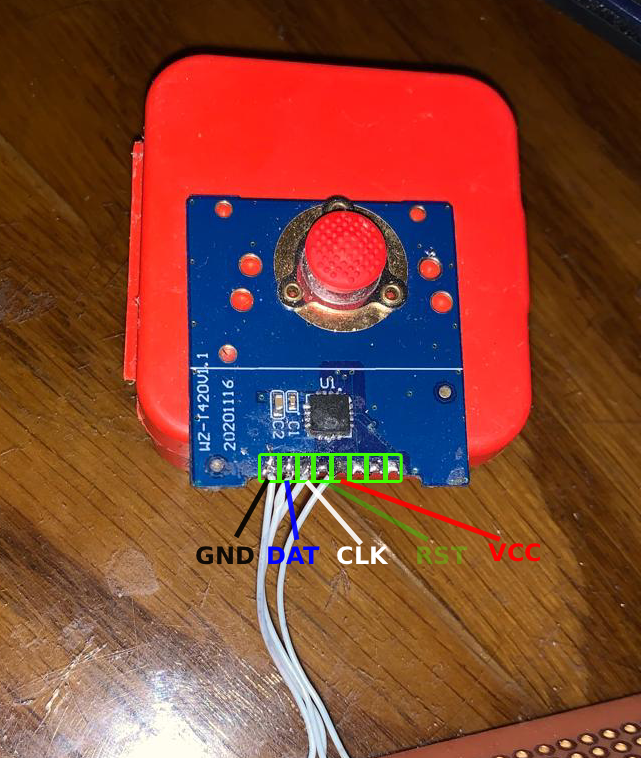

# tp_shield — ZMK Shield for an Obscure USB Trackpoint

ZMK shield for **NiceNano V2** (Supermini nRF52840) that adds an unmarked Chinese PS/2 trackpoint module. Requires a custom fork of [Kim's PS/2 driver](https://github.com/infused-kim/kb_zmk_ps2_mouse_trackpoint_driver) that skips the standard init handshake.



## Background

This trackpoint IC is a fixed-function motion encoder that behaves differently from standard PS/2 devices:

- **Starts streaming motion packets immediately** on power-up — no "Enable Data Reporting" (`0xF4`) needed.
- **Rejects all host commands** (`0xFF` reset, `0xF4` enable, `0xF3` set sample rate, etc.) with error codes.
- **RST pin must float** — driving it high/low does nothing.

This is the exact IC documented [here by db7](https://randalea.de/~db7/crunch-ps2-decoder.html) who reverse-engineered it using a [Teensy 2.0](https://randalea.de/~db7/teensy-logic-analyzer.html) and a CRUNCH Scheme PS/2 decoder. The same quirks apply here.

Because this IC never responds to host commands, **Kim's stock ZMK PS/2 driver hangs** waiting for ACKs after each command byte. The device must be treated as a read-only streaming source — skip all init and just parse the raw motion packets.

## Hardware

| NiceNano | Trackpoint |
|----------|------------|
| P0.06    | CLK        |
| P0.08    | DAT        |
| GND      | GND        |
| —        | RST (float)|
| 3.3V     | VCC        |



## Software Setup

### 1. West Manifest

The `config/west.yml` references the `stream-only-mode` branch of `kb_zmk_ps2_mouse_trackpoint_driver`:

```yaml
manifest:
  remotes:
    - name: infused-kim
      url-base: https://github.com/infused-kim
    - name: Maged-William
      url-base: https://github.com/Maged-William
  projects:
    - name: kb_zmk_ps2_mouse_trackpoint_driver
      remote: Maged-William
      revision: stream-only-mode
    - name: zmk
      remote: infused-kim
      revision: pr-testing/mouse_ps2_module_base
      import: app/west.yml
  self:
    path: config
```

This fork of Kim's driver ([badjeff's to be exact](https://github.com/badjeff/kb_zmk_ps2_mouse_trackpoint_driver)) it adds `CONFIG_ZMK_INPUT_MOUSE_PS2_STREAM_ONLY` — a compile-time option that skips all init commands and goes straight to reading streaming data.

### 2. Kconfig (`trackpoint.conf`)

```kconfig
# Skip all PS/2 init handshakes — this IC cannot be configured
CONFIG_ZMK_INPUT_MOUSE_PS2_STREAM_ONLY=y

# Filter corrupted packets before they cause bogus mouse jumps
CONFIG_ZMK_INPUT_MOUSE_PS2_ENABLE_ERROR_MITIGATION=y
```

### 3. Devicetree Overlay (`trackpoint.overlay`)

The shield declares a `gpio-ps2` node that bit-bangs the PS/2 protocol using GPIO interrupts on CLK falling edge:

```devicetree
gpio_ps2: gpio_ps2 {
    status = "okay";
    compatible = "gpio-ps2";
    scl-gpios = <&gpio0 6 GPIO_ACTIVE_HIGH>;  // CLK
    sda-gpios = <&gpio0 8 GPIO_ACTIVE_HIGH>;  // DAT
};

mouse_ps2: mouse_ps2 {
    status = "okay";
    compatible = "zmk,input-mouse-ps2";
    ps2-device = <&gpio_ps2>;
};

mouse_ps2_input_listener: mouse_ps2_input_listener {
    compatible = "zmk,input-listener-ps2";
    status = "okay";
    device = <&mouse_ps2>;
};
```

## Building

Use the standard ZMK Docker build workflow:

```bash
west build -b nice_nano_v2 -- -DSHIELD=trackpoint
```

Or push to GitHub and let the CI workflow in `.github/workflows/build.yml` handle it.

## Status

- Motion packets are decoded and the pointer moves.
- All three buttons work.
- Error mitigation catches many corrupted frames.

### TODO

- **Stutter**: About 98% there — the pointer still stutters occasionally. Likely causes:
  - Timing jitter in the GPIO interrupt-based bit-banging: CLK edges from this IC may not be perfectly uniform, and the nRF52840 GPIO interrupt latency can vary.
  - Parity/frame errors that slip past the error mitigation filter.
  - Possible mismatch between the GPIO bit-banging timing and this IC's clock frequency.
  
  Investigation is ongoing — the `crunch-ps2decoder` reference implementation in `Specs/` uses hardware USART in sync-slave mode to avoid exactly these timing issues, but the nRF52840 lacks a USART with synchronous slave capability.


## Special Thanks

* [@infused-kim](https://github.com/infused-kim)
* [@db7](https://github.com/db7)
* [@badjeff](https://github.com/badjeff)
